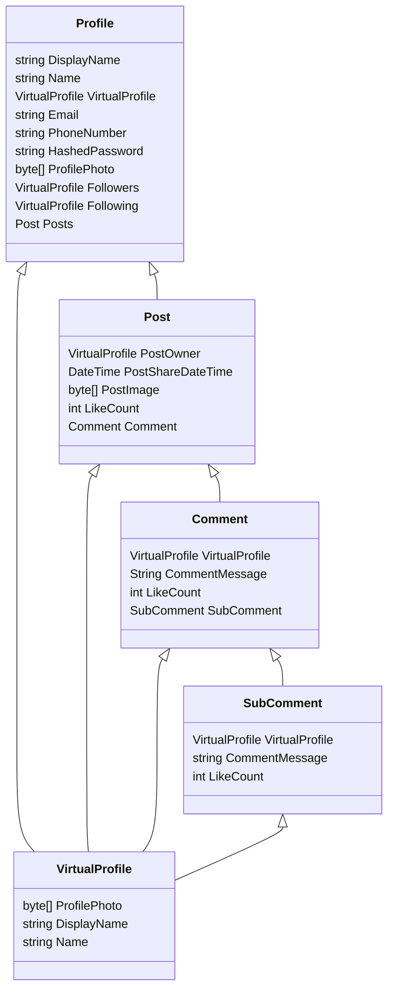

```mermaid
classDiagram
    direction TB
    Profile <|-- Post
    Profile <|-- VirtualProfile
    Post <|-- Comment
    Post <|-- VirtualProfile
    Comment <|-- SubComment
    Comment <|-- VirtualProfile
    SubComment <|-- VirtualProfile

    class Comment{
        VirtualProfile VirtualProfile
        String CommentMessage
        int LikeCount
        SubComment SubComment
    }

    class SubComment{
        VirtualProfile VirtualProfile
        string CommentMessage
        int LikeCount
    }

    class VirtualProfile{
        byte[] ProfilePhoto
        string DisplayName
        string Name
    }

    class Post{
        VirtualProfile PostOwner
        DateTime PostShareDateTime
        byte[] PostImage
        int LikeCount
        Comment Comment
    }

    class Profile{
        string DisplayName
        string Name
        VirtualProfile VirtualProfile
        string Email
        string PhoneNumber
        string HashedPassword
        byte[] ProfilePhoto
        VirtualProfile Followers
        VirtualProfile Following
        Post Posts
    }
```